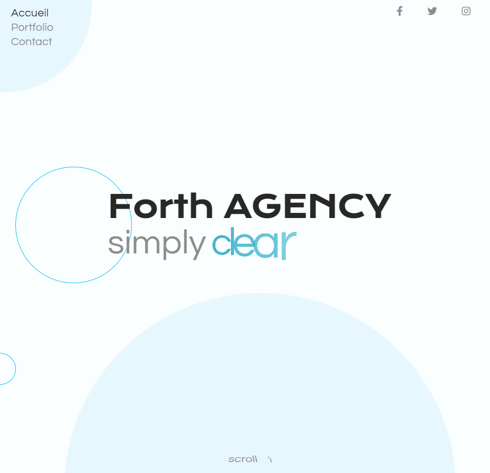
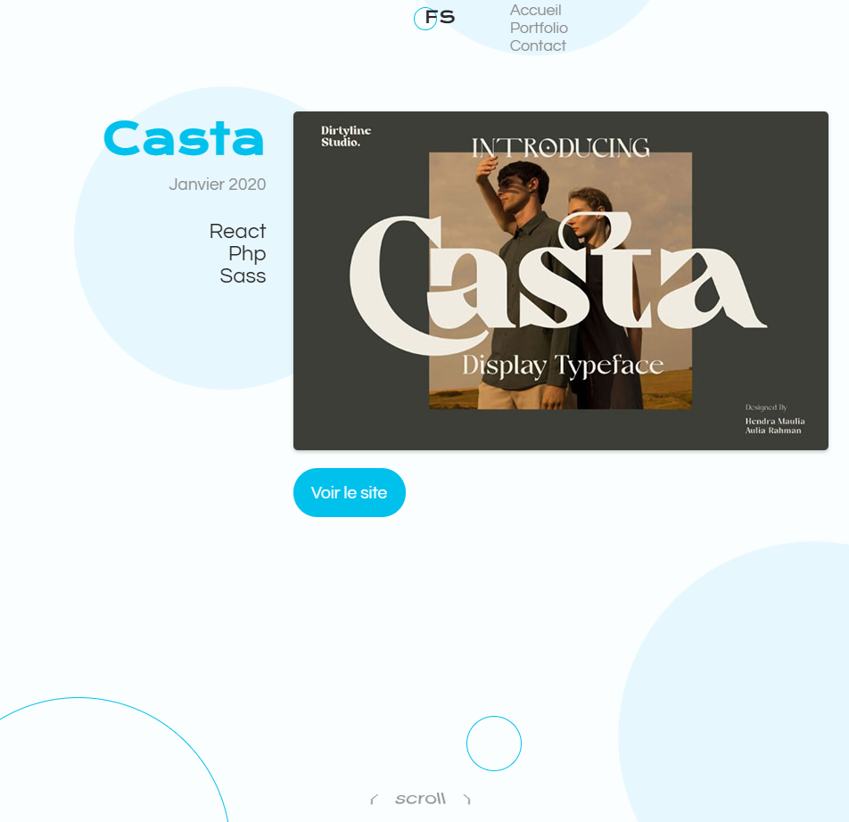
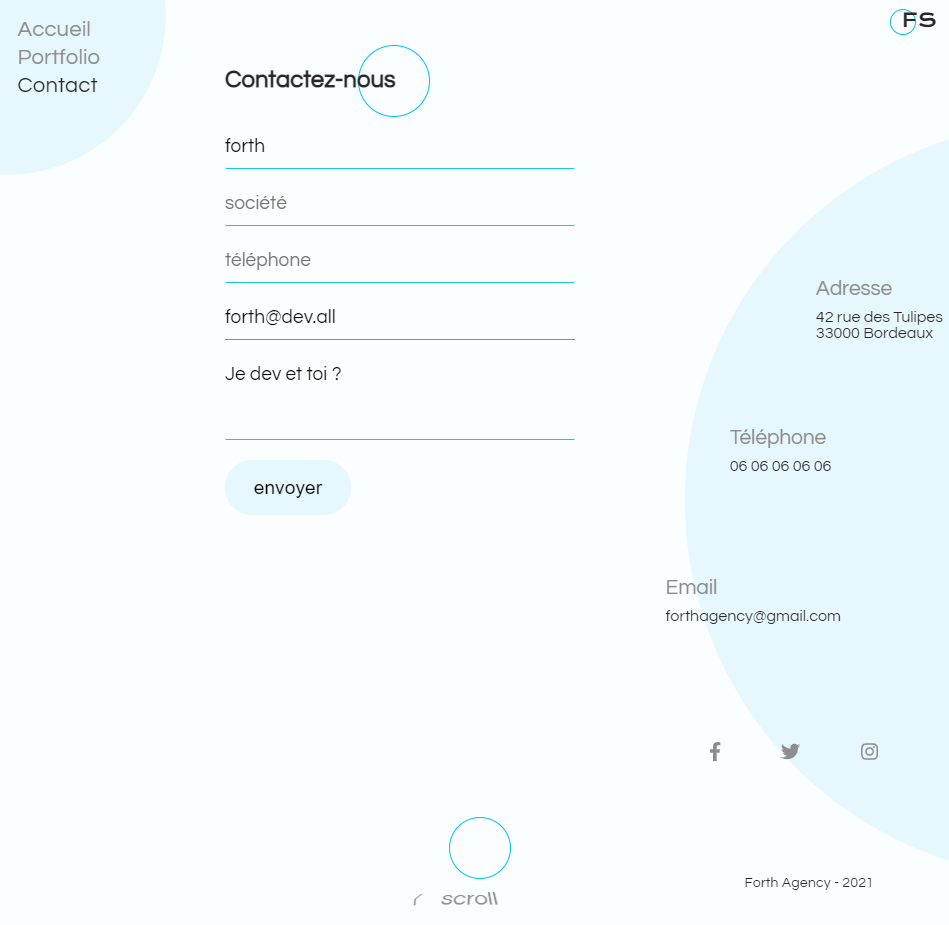

# Introduction

Petit projet Réact qui utilise des animations. La vidéo source est : [Créer un site victrine en React](https://www.youtube.com/watch?v=slzhcco9Cog).

# Intérêts du projet

Le réel intérêt de ce projet est l'ensemble des animations fait via Réact. De plus, je trouve intéressant le système de navigation horizontale au scroll.

# Difficultés rencontrées et améliorations apportées

Plusieurs difficultés ont été rencontrées durant le développement de ce projet. J'ai pour habitude de ne pas recopier bêtement le contenu de la vidéo et cherche en permanance à optimiser le code, ainsi que le mettre à jour.

### Page des projets

L'une de ces difficultés était d'optimiser la page des projets que je trouvais très redondante. Ici, 4 projets sont présentés, ce qui représente déjà 4 fois trop de code, comme le montre l'image ci-dessous : 

Afin d'optimiser cela, j'ai utiliser un tableau pour gérer le menu de navigation du base, et exporter dans la page projet tout ce qui ne changer pas : 

### Scroll navigation

La seconde page qui m'a posé quelques problèmes à optimiser était la page App, pour la gestion de la navigation à l'aide du scroll.

Le code de base gérait cela à l'aide d'un switch pour générer la page précédente et suivante. Un setTimeout a été ajouté pour contrer le fait de changer 40 fois de page via un gros mouvement de la molette. 
 
 

Pour gérer cela, j'ai créé une fonction pour controler tous les scrolls : 

Auquel j'ajoute un wait avant chaque changement de page. Ce wait récupère le timestamp actuel et le compare avec le timestamp de la précédente navigation : 

Enfin, je génère le router de façon dynamique afin de n'avoir qu'une variable à modifier pour ajouter autant de projets que je souhaite.

### Le text dynamique de l'accueil

J'ai voulu améliorer le code présenter lors de la vidéo qui n'était pas complètement accepté par eslint. J'ai essayé plusieurs solutions, sans réelle succès.

J'ai au plus réussi à faire un affichage lettre par lettre, mais je n'ai pas réussit à refaire la même animation. Je suis donc revenu en arrière, sans avoir complètement réussit.

J'ai seulement amélioré l'utilisation du composant : 
Avant 

Après 

### Un affichage parfois bugué

Parfois l'affichage de la page n'était pas celui souhaité, probablement à cause des éléments tel que les cercles en fond.

Je n'ai pas réussi à trouver la source.

# Ce que m'a apporté ce projet

D'abord, l'utilisation de Réact. Plus je code du Réact, plus je m'habitue à ses normes.

Ensuite, j'ai bien aimé ce système de navigation horizontale au scroll. Ca pourra toujours resservir à un moment ou un autre.

De plus, ce projet m'a montré de nombreuses façons d'animer une page : que cela soit par du texte dynamique (sur le home), des éléments qui apparaissent à des positions aléatoires (les cercles en fond), des animations d'arrivée et de sorti différente (pour les pages et les projets), voir même des animations générées aléatoirement (pour l'arrivée des images de projet) et j'en passe.

# Screenshots du projet

